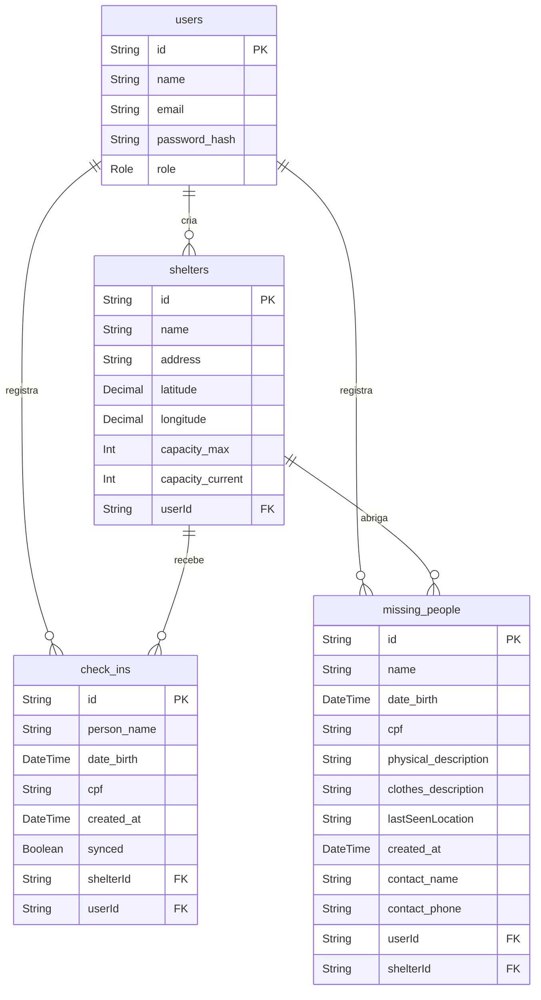

# 🆘 Ponto Seguro API

[](https://github.com/DanyloHenrique/ponto_seguro_api/actions/)
[](https://github.com/DanyloHenrique/ponto_seguro_api/actions/)
[](https://codecov.io/github/DanyloHenrique/ponto_seguro_api)

<br>


O **Ponto Seguro** é uma plataforma de backend desenvolvida para centralizar informações e facilitar a gestão em situações de emergência climática e desastres naturais. O sistema foca na organização de abrigos e, principalmente, na conexão de famílias através de um sistema inteligente de "Match" para pessoas desaparecidas.

🔗 **FrontEnd:** [github.com/DanyloHenrique/ponto_seguro](https://github.com/DanyloHenrique/ponto_seguro)

## 🚀 Funcionalidades Principais

* **Autenticação Segura:** Sistema de registo e login para voluntários com passwords hasheadas (bcryptjs) e autenticação via JWT.
* **Gestão de Abrigos:** Registo de pontos de apoio com controlo de capacidade em tempo real.
* **Geolocalização (Nearby Shelters):** Procura de abrigos num raio de proximidade utilizando a fórmula de Haversine.
* **Registo de Desaparecidos:** Base de dados para famílias reportarem desaparecimentos com descrições físicas e fotos.
* **Sistema de Match:** Ao realizar um check-in num abrigo, o sistema cruza os dados automaticamente com a base de desaparecidos e notifica os responsáveis.

## 🛠 Tecnologias e Ferramentas

* **Runtime:** Node.js com TypeScript
* **Framework:** Express 5
* **ORM:** Prisma ORM (PostgreSQL)
* **Validação:** Zod
* **Testes:** Vitest (Unitários e Integração)
* **Segurança:** JSON Web Token (JWT) & bcryptjs
* **Infraestrutura:** Docker & Docker Compose

## 🏗 Arquitetura

O projeto segue princípios de engenharia de software modernos para garantir manutenibilidade:

* **Domain-Driven Design (DDD):** Organização por domínios de negócio (Shelter, User, Missing Person).
* **SOLID:** Aplicação rigorosa dos princípios, especialmente Inversão de Dependência.
* **Clean Architecture:** Separação clara entre Regras de Negócio (Use Cases), Camada de Dados (Repositories) e Camada de Entrada (Controllers).
* **In-Memory Testing:** Repositórios em memória para garantir rapidez na execução dos testes.

## 🧠 Desafios técnicos

### Configuração do Prisma v7 com schemas dinâmicos nos testes E2E

O Prisma v7 introduziu uma mudança significativa na forma de instanciar o client,
exigindo o uso explícito de adapters. O desafio foi configurar o `PrismaPg` para
suportar schemas dinâmicos no PostgreSQL — uma estratégia usada nos testes E2E para
isolar cada execução em seu próprio schema, evitando conflitos entre testes paralelos.

A solução exigiu extrair o schema manualmente da connection string e passá-lo para
o adapter, algo praticamente não documentado pela equipe do Prisma para essa versão:

```typescript
const url = new URL(connectionString)
const schema = url.searchParams.get('schema') ?? 'public'

const pool = new pg.Pool({ connectionString })
const adapter = new PrismaPg(pool, { schema })
```

### Dependência circular entre casos de uso

O caso de uso de check-in precisava verificar se a pessoa estava registrada como
desaparecida, e o caso de uso de registrar pessoa desaparecida precisava verificar
se a pessoa já tinha check-in em algum abrigo — criando uma dependência circular.

A solução foi extrair essa lógica para um serviço de domínio (`PersonMatchService`),
que consulta ambos os repositórios e retorna o resultado. Por não representar uma
interação direta do usuário, não se enquadra como caso de uso — é uma operação
puramente interna, consumida por ambos os casos de uso sem criar acoplamento entre eles.

### Adição do CPF como campo opcional em check-in e pessoa desaparecida

O campo `cpf` foi adicionado posteriormente ao desenvolvimento inicial, exigindo
uma manutenção transversal: migration no banco, atualização dos schemas de validação
(Zod), repositórios, casos de uso, testes unitários e E2E. Por ser opcional, também
foi necessário garantir que toda a lógica de busca por nome e data de nascimento
continuasse funcionando corretamente quando o CPF não fosse informado.

Os testes unitários e E2E foram fundamentais nesse processo — garantiram que as
alterações não quebraram comportamentos já existentes, tornando a manutenção
muito mais segura e confiante.

## 📁 Estrutura do Projeto

```
src/
├── domain/                  # Domínios de negócio (DDD)
│   ├── @services/           # Serviços compartilhados entre domínios
│   ├── auth/               
│   │   ├── controller/
│   │   └── use-cases/
│   │       └── factories/
│   ├── check-in/            # Check-in em abrigo
│   │   ├── http/controller/
│   │   ├── repositories/
│   │   │   ├── in-memory/   # Repositórios para testes
│   │   │   └── prisma/      # Repositórios de produção
│   │   └── use-cases/
│   │       └── factories/
│   ├── missing-person/      # Registo e consulta de desaparecidos
│   │   └── ...              # (mesma estrutura)
│   ├── shelter/             # Gestão de abrigos
│   │   └── ...
│   └── user/                # Módulo de usuário
│       └── ...
├── env/                     # Validação e tipagem das variáveis de ambiente
├── errors/                  # Classes de erros customizados
├── lib/                     # Instâncias compartilhadas (ex: Prisma Client)
├── middleware/               # Middlewares Express (auth, error handler)
└── utils/
    └── test/                # Utilitários de apoio aos testes
```

## Diagramas



## 📖 Documentação da API

A documentação detalhada das rotas e modelos de dados pode ser acedida através da nossa coleção do Postman:

> **🔗 [Ponto Seguro - API ](https://documenter.getpostman.com/view/42447767/2sBXqJJL6q)**

## 🛠 Instalação e Execução
Siga os passos abaixo para rodar o backend localmente na sua máquina:

### Pré-requisitos

- **Node.js** - v20.x ou superior — *projeto desenvolvido na v25.5.0*
- **PNPM** - v9.x ou superior — *projeto desenvolvido na v10.33.2*
- **Docker**

- Caso ainda não tenha o pnpm instalado:
```bash
npm install -g pnpm
```

1.  **Clonar o Repositório:**
```bash
git clone https://github.com/DanyloHenrique/ponto_seguro_api.git
cd ponto_seguro_api
```

2.  **Instalar Dependências:**
```bash
pnpm install
```

3.  **Configurar Variáveis de Ambiente:**
Crie um arquivo `.env` baseado no `.env.example`.

4. **Suba o banco de dados**
```bash
docker-compose up -d
```

5. **Execute as migrations**
```bash
pnpm run migrate
```

6.  **Iniciar Servidor:**
```bash
pnpm run dev
```
---

## 🧪 Testes

### Unitários
```bash
pnpm test
```

### E2E
> ⚠️ Os testes E2E precisam do banco de dados rodando (`docker-compose up -d`)
```bash
pnpm test:e2e
```

### Cobertura
```bash
pnpm test:coverage
```

### Interface visual (Vitest UI)
```bash
pnpm test:ui
```
